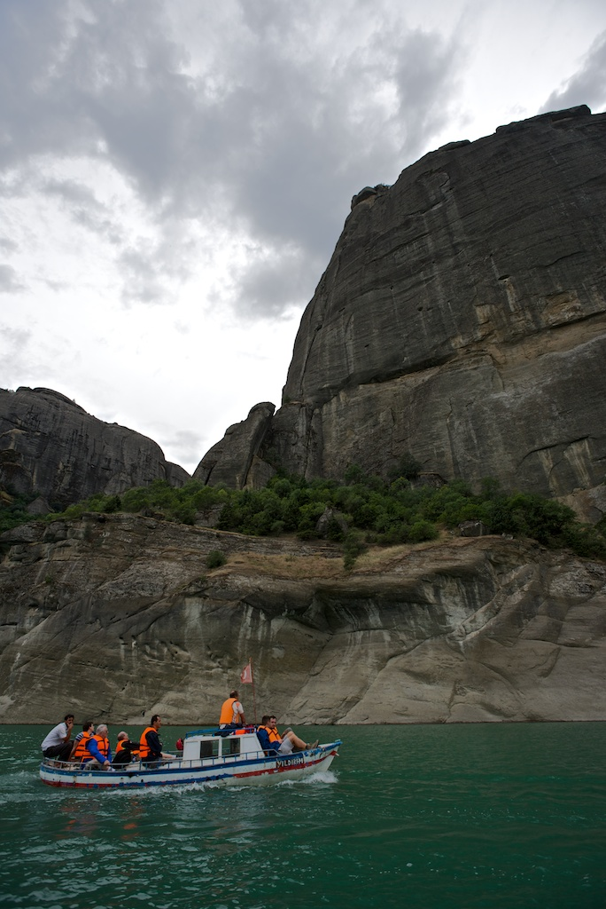

title: ripresa delle trasmissioni
tags: misc, notes
slug: after-a-long-pause
lang: it

Breve comunicazione di servizio per dire a tutti quelli che mi seguono che presto, prestissimo, riprenderanno le trasmissioni.

Ho avuto da fare con trasloco, lavoro, stare con la famiglia, il collegamento internet che non si collegava, e varie altre robe che occupano la quotidianità insomma. Alcune di queste ti prosciugano mentalmente, altre sono semplicemente impegni da cui non voglio sottrarmi perché nonostante il tempo che ti prendono, ti danno in cambio sensazioni ed emozioni irripetibili e sfuggenti (vedi le due foto qui sotto).

  

La conseguenza dunque è stata una mancanza di aggiornamenti sul mio blog da gennaio 2014, una uguale assenza da altri canali ([twitter](http://twitter.com/aadmtwi), [Google+](http://plus.google.com/+AlessandroAmatodelMonte/)) dove di tanto in tanto mi affacciavo, e una traballante pila di idee, spunti, bozze prevalentemente di argomento fotografico che avrò difficoltà a riordinare e rendere pubblica.

Nonostante sia in Turchia per un field trip geologico, al primo punto vorrei rimediare partendo da oggi; da quella traballante pila ho tirato fuori qualcosa di meno instabile che metterò online nei prossimi giorni.

RIguardo gli altri due punti, e cioè una certa partecipazione a questi flussi amorfi di conversazione e idee, ho sempre meno stimoli a farlo, a prescindere dalla minore o maggiore fisicità degli stessi; lasciare qualcosa di compiuto su twitter o google+ o partecipare in modo attivo alle attività del circolo fotogafico locale,  sono cose che mi succhiano troppa energia in confronto ai benefici/piacere/compensi che ne traggo in cambio. Scusami, Mondo, ma tengo più alla mia famiglia che a te.

Scrivo qui gli argomenti di cui parlerò prossimamente, poi ci risentiamo a fine anno per vedere se sono riuscito a chiuderne almeno una parte:

* finalizzazione dei progetti San Donato e Milano;
* aggiornamento sul progetto fotografico 365-valentina con presentazione del piccolo programma scritto in Python per documentare lo stato corrente, senza contravvenire al [mio principio guida](./2014-01-04-valentina-365.html);
* creazione del mio portfolio -- ma quello fisico, su carta, come si faceva  una volta (sono in procinto di comprarmi una stampante fotografica seria; la carta, quella sta già ordinata);
* raccontare come uso Python a lavoro, ispirato dall'animo open source dei brillanti ragazzi di Agile Geoscience;
* piccolo riassunto [sullo stato delle mie bici](./2014-01-13-stolen-bikes.html) e su come sia rinato con questa Norco Shinobi;
* appunti di street photography.

Infine, e in parziale contraddizione col mio allontanamento dai social network di cui parlavo prima, ho riattivato il mio account tumblr[^nota-tumblr] e ho aperto un nuovo stream che si chiama [aadm-fotografia.tumblr.com](http://aadm-fotografia.tumblr.com), su cui trovate piccole collezioni di mie foto, in aggiunta alle serie più ragionate che continuerò a pubblicare qui. Un esempio delle cose pubblicate finora:

* Le foto con cui ho partecipato alla [prima](http://aadm-fotografia.tumblr.com/post/77942918166/concorso-fotografico-interno-del-circolo), [seconda](http://aadm-fotografia.tumblr.com/post/77943379950/seconda-tappa-con-tema-gente-che-mangia-la), [terza](http://aadm-fotografia.tumblr.com/post/77943667241/terza-tappa-del-concorso-fotografico-la-mia-citta) e [quarta](http://aadm-fotografia.tumblr.com/post/86822407706/quarta-tappa-del-concorso-fotografico-interno-del) puntata del concorso fotografico interno (la quinta la metterò online dopo che rientro dalla Turchia);
* [Parma](http://aadm-fotografia.tumblr.com/post/78479862151/parma-in-varie-stagioni-e-condizioni-di-luce), in varie condizioni di stagioni e luce;
* Variazioni sul tema "Dall'alto", [parte 1](http://aadm-fotografia.tumblr.com/post/86823298186/sempre-in-tema-di-concorso-fotografico-spesso-mi) e [parte 2](http://aadm-fotografia.tumblr.com/post/86823500781/oppure-se-avessi-usato-delle-fotografie-piu).
* Valentina che fa le smorfie, [parte 1](http://aadm-fotografia.tumblr.com/post/86931116786/valentina-fa-le-smorfie-1) e [parte 2](http://aadm-fotografia.tumblr.com/post/86931497736/valentina-fa-le-smorfie-2).

[^nota-tumblr]: Nei 4 mesi di internet shutdown che ho sofferto, ho scoperto che (1) potevo arrivare con più facilità su tumblr per mettere online delle foto, (2) avevo trovato questo template minimalista ma elegante, che mi permetteva di pubblicare foto belle grandi come piace a me. Nonostante il desiderio di semplificare le cose, a volte la voglia di novità continua ad avere il sopravvento su di me.
